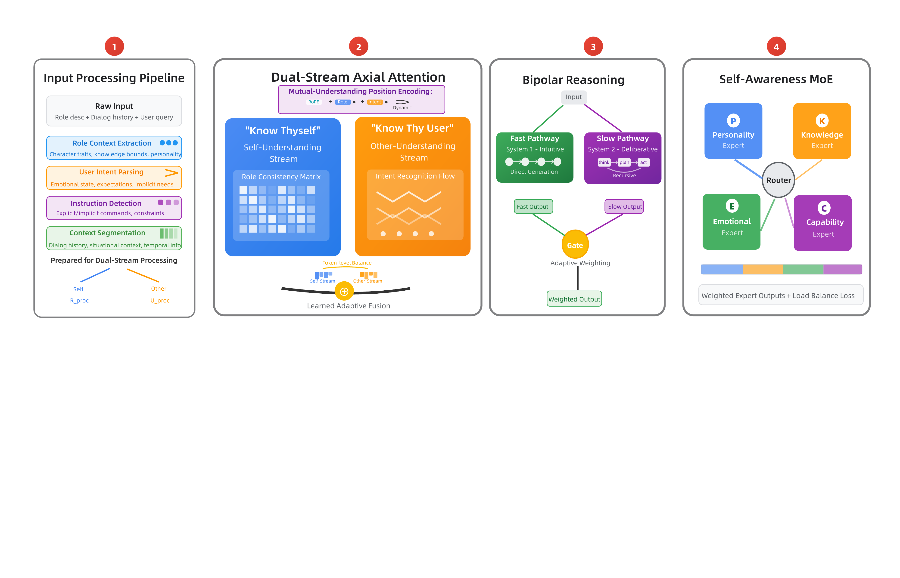

# KSKT

**Know Thyself, Know Thy User: Intrinsic Dual-Perspective Reasoning for Role-Playing LLMs**

[ICML 2026] · Haotong Sun, Jianye Xie, Bocheng Xu, Yinghui Jiang

> Reference implementation of KSKT — an architectural approach to the
> *character–user conflict* in role-playing LLMs. Dual-perspective
> reasoning is embedded **inside** the attention mechanism, enabling
> token-level arbitration between role authenticity and user intent
> rather than post-hoc reconciliation.

---

## TL;DR

| Component | Role | Section |
|---|---|---|
| **DSAA** — Dual-Stream Axial Attention | Factorize attention into a *self*-stream (role constraints) and an *other*-stream (user intent); fuse with token-level weights satisfying α + β = 1. | §3.2 |
| **MUPE** — Mutual-Understanding Position Encoding | Augment RoPE with learned relevance signals f_self, f_other. | §3.2 |
| **BRM** — Bipolar Reasoning Module | System-1 fast FFN + System-2 ThinkingChain with adaptive budget T ∈ {2,4,6,8,10}; two-stage gating avoids circular dependency. | §3.3 |
| **SAMOE** — Self-Awareness MoE | Four experts (Personality / Knowledge / Emotion / Capability), character-conditioned top-k routing, load balancing. | §3.4 |

**Headline results.** Starting from Qwen3-4B-Thinking-2507:

- **CharacterBench**: +6.2% overall over base; surpasses every open-source baseline up to 72B with ~18× fewer parameters; competitive with frontier closed-source models (Table 1).
- **SOTOPIA**: **+19.3% on Relationship** — the dimension that most directly probes self-other coordination (Table 2).
- **Stream specialization**: linear-probe cross-dissociation of +21.3 / +20.8 pp confirms the two streams encode genuinely distinct information (Table 3).
- **Overhead**: ~19.5% latency, comparable to standard MoE; learned routing keeps simple queries on System-1.

Concurrent companion paper: [**BRIDGE**](https://github.com/Sunrich-HT/BRIDGE) — cross-turn long-horizon persona consistency. KSKT targets intra-turn conflict; the two compose naturally.

---

## Architecture

<p align="center">
  
</p>

KSKT processes role-playing dialogues through four integrated components
(Figure 1 in the paper):

1. **Input Processing Pipeline** — extracts role context `R_proc` and user intent `U_proc`.
2. **Dual-Stream Axial Attention** — separately models the *self*-understanding and *other*-understanding streams, then fuses them with token-level weights satisfying α + β = 1.
3. **Bipolar Reasoning** — combines a fast intuitive pathway (System-1) with a slow deliberative ThinkingChain (System-2); a two-stage gate decides when to invoke deliberation and at what budget T ∈ {2,4,6,8,10}.
4. **Self-Awareness Mixture of Experts** — routes to Personality (P), Knowledge (K), Emotion (E), and Capability (C) specialists.

Algorithm 1 in the paper summarises the exact forward pass; the
corresponding Python is in [`kskt/modeling_kskt.py`](kskt/modeling_kskt.py).

---

## Installation

```bash
git clone https://github.com/Sunrich-HT/KSKT.git
cd KSKT
pip install -e .
# Optional, for full preprocessing as described in Appendix B.1:
# pip install spacy && python -m spacy download en_core_web_sm
```

Tested with **Python 3.10+, PyTorch 2.1+, transformers 4.45+**.

---

## Quickstart (CPU smoke test)

```bash
python examples/quick_forward.py
```

This instantiates a small KSKT model (no pretrained weights), runs a
forward pass, and prints α/β ranges and per-expert load — useful to
verify the wiring is correct on a laptop.

---

## Training

Reproduces the three-phase recipe of §3.5 / Appendix C.3:

| Phase | Epochs | LR | Active losses |
|---|---|---|---|
| 1 — Self-Understanding Foundation | 2 | 2e-5 | L_CLM + λ₁ L_consistency |
| 2 — Other-Understanding Addition | 1 | 1e-5 | + λ₂ L_understanding |
| 3 — Mutual Integration | 1 | 5e-6 (cosine) | + λ₃ L_balance (full Eq. 11) |

```bash
export TRAIN_JSONL=data/role_dialogues.jsonl
export BASE_MODEL=Qwen/Qwen3-4B-Thinking-2507
export OUTPUT_DIR=runs/kskt_4b
bash scripts/train_all_phases.sh
```

`TRAIN_JSONL` should be a file where each line follows the schema in
[`examples/sample_data.jsonl`](examples/sample_data.jsonl):

```json
{"role": "<character description>",
 "history": [{"speaker": "user", "text": "..."}, {"speaker": "assistant", "text": "..."}],
 "response": "<gold reply>"}
```

The 130 K training mixture used in the paper (15 K PersonaHub profiles
+ 55 K general instructions + 60 K role dialogues) is reproducible
following the recipe in Appendix C.1.

---

## Evaluation

### CharacterBench (Table 1)

```bash
CKPT=runs/kskt_4b/phase3_mutual.pt \
BENCH=data/characterbench/test.jsonl \
bash scripts/eval_characterbench.sh
```

The script uses greedy decoding (temperature = 0) for determinism, as
in the paper, and reports per-dimension scores in `results/characterbench.json`.

### SOTOPIA (Table 2)

```bash
pip install sotopia   # official evaluator
CKPT=runs/kskt_4b/phase3_mutual.pt \
SCENARIOS=data/sotopia/scenarios_180.jsonl \
bash scripts/eval_sotopia.sh
```

### Linear probing — stream specialization (Table 3)

```bash
python -m kskt.evaluation.linear_probing \
    --checkpoint runs/kskt_4b/phase3_mutual.pt \
    --probe_jsonl data/probes/stream_specialization.jsonl
```

Reproduces the cross-dissociation result: self-stream → role attributes
80.5 %, other-stream → user intent 79.9 %, with ~+21 pp gaps over the
matched off-target probes.

---

## File layout

```
KSKT/
├── configs/
│   └── kskt_4b.yaml                # Hyperparameters (Table 4)
├── kskt/
│   ├── config.py                   # KSKTConfig dataclass
│   ├── dsaa.py                     # §3.2 Dual-Stream Axial Attention
│   ├── mupe.py                     # §3.2 Mutual-Understanding PE
│   ├── bipolar.py                  # §3.3 Bipolar Reasoning Module
│   ├── samoe.py                    # §3.4 Self-Awareness MoE
│   ├── losses.py                   # Eq. 11 + budget supervision
│   ├── modeling_kskt.py            # Algorithm 1 — full forward pass
│   ├── data/
│   │   ├── preprocessing.py        # R_proc / U_proc extraction
│   │   └── dataset.py              # KSKTDialogueDataset, collate_kskt
│   ├── training/
│   │   ├── trainer.py              # 3-phase trainer
│   │   └── train.py                # CLI entry point
│   └── evaluation/
│       ├── eval_characterbench.py  # Table 1 protocol
│       ├── eval_sotopia.py         # Table 2 protocol
│       └── linear_probing.py       # Table 3 protocol
├── scripts/
│   ├── train_all_phases.sh
│   ├── eval_characterbench.sh
│   └── eval_sotopia.sh
├── examples/
│   ├── quick_forward.py            # CPU smoke test
│   └── sample_data.jsonl
├── requirements.txt
├── setup.py
└── LICENSE                         # Apache-2.0
```

---

## Reproducing the main table numbers

| Metric (zh / en) | Base (Qwen3-4B-Thinking) | + FT (same data/recipe) | **KSKT (Full)** |
|---|---|---|---|
| **AVG** | 3.69 / 3.63 | 3.80 / 3.75 | **3.92 / 3.87** |
| Persona — AC_b | 4.35 / 4.30 | 4.52 / 4.47 | **4.73 / 4.67** |
| Persona — BC_b_P | 3.65 / 3.60 | 3.81 / 3.75 | **3.97 / 3.91** |
| Emotion — ER | 2.95 / 2.82 | 3.11 / 2.97 | **3.40 / 3.25** |

| SOTOPIA | Base | + 3-shot | KSKT | **KSKT + 3-shot** |
|---|---|---|---|---|
| Relationship | 1.45 | 1.58 | 1.73 | **1.87** |
| Goal | 7.07 | 7.60 | 7.95 | **8.43** |
| Overall | 3.08 | 3.28 | 3.30 | **3.48** |

Architectural attribution (Table widerft_attribution): under iso-parameter
& iso-supervision conditions, ~75 % of KSKT's gain over the FT baseline
is attributable to the dual-stream factorization itself.

---

## Citation

```bibtex
@inproceedings{sun2026kskt,
  title     = {Know Thyself, Know Thy User: Intrinsic Dual-Perspective Reasoning for Role-Playing LLMs},
  author    = {Sun, Haotong and Xie, Jianye and Xu, Bocheng and Jiang, Yinghui},
  booktitle = {Proceedings of the International Conference on Machine Learning (ICML)},
  year      = {2026},
}
```

Companion work (cross-turn persona consistency):

```bibtex
@inproceedings{sun2026bridge,
  title     = {BRIDGE: Triangular Fixed-Point Refinement for Long-Horizon Persona Consistency},
  author    = {Sun, Haotong and others},
  booktitle = {Proceedings of the International Conference on Machine Learning (ICML)},
  year      = {2026},
}
```

---

## License

Apache-2.0. See [LICENSE](LICENSE).
